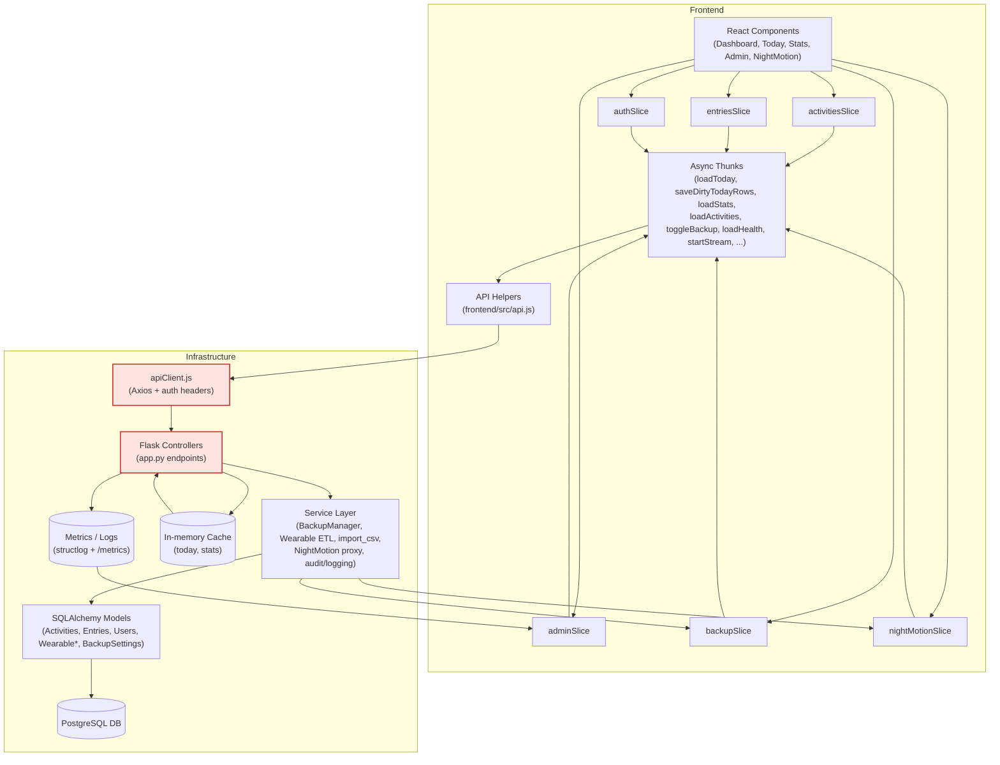
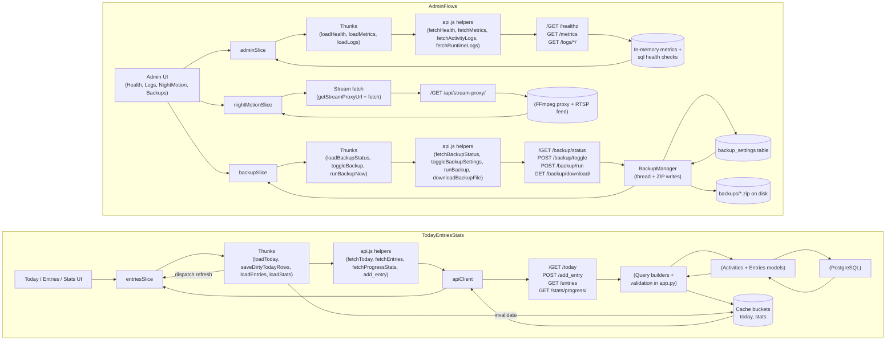

# Mosaic Dependency Graphs

This document complements `docs/architecture/dependency-map.md` with visual diagrams that highlight the primary dependency paths across Mosaic’s frontend and backend. Pair it with the [Redux Flow map](redux-flow.md), [Backend Call Tree](backend-call-tree.md), and [Dependency Matrix](dependency-matrix.md) for text-first perspectives. All diagrams use Mermaid syntax for easy inclusion in docs and code reviews.

## Global Flow: Components → Redux → API → Backend

`apiClient.js` and the Flask controllers act as high-coupling nodes (highlighted) because every request crosses those boundaries. They demand extra care when introducing breaking changes.

## Data-Flow Focus: Today/Entries/Stats & Admin/Backup/Metrics

**Cycles & Coupling Notes**
- The Today/Entries/Stats cluster includes an intentional feedback loop: writes (`saveDirtyTodayRows`/`add_entry`) immediately invalidate caches and re-dispatch `loadToday`, `loadEntries`, and `loadStats`. This keeps the UI consistent but couples `entriesSlice` tightly to other slices—any new feature should reuse these dispatches to avoid stale state.
- In the Admin cluster, `BackupManager` touches both the database (scheduler state) and the filesystem (ZIP exports), making it a high-coupling service. Similarly, the NightMotion stream proxy depends on external cameras via FFmpeg; failures propagate back to `nightMotionSlice` status updates.
- Metrics flows feedback into the Admin Health UI; because `/metrics` and `/healthz` share the in-memory registry, noisy endpoints can impact operator dashboards. Treat controller additions carefully to preserve metric labeling.
