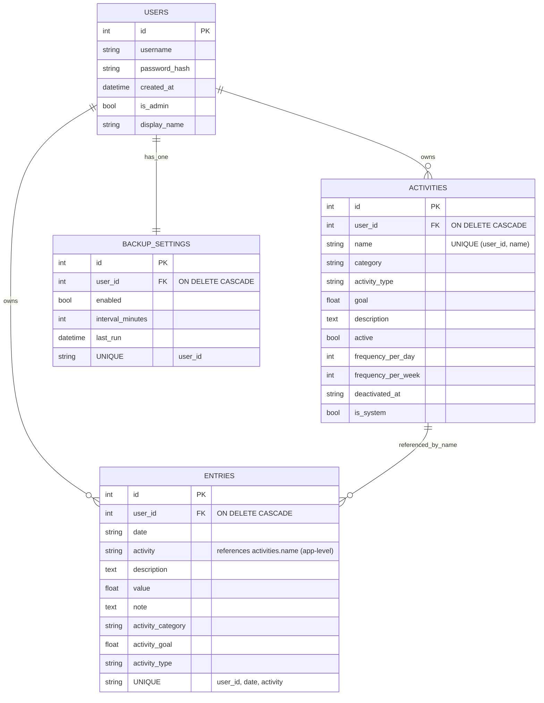

# Database ERD (current)

**Notes:**
- All user-owned tables include `user_id` and cascade on user deletion.
- Activity names are unique per user; different users can share names safely.
- Entries are scoped by `(user_id, date, activity)`; no cross-user leakage.
