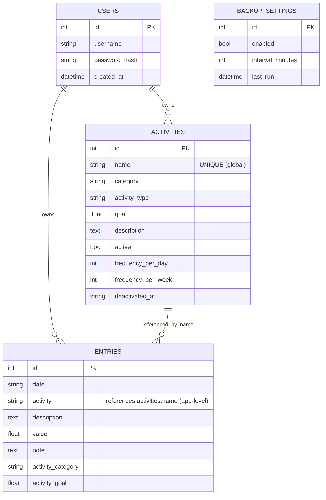

# Database ERD (current)

**Known gaps:**
- `activities` and `entries` are not scoped by `user_id` (global namespace).
- No FK between `entries.activity` and `activities.id/name` (app enforces via code).
